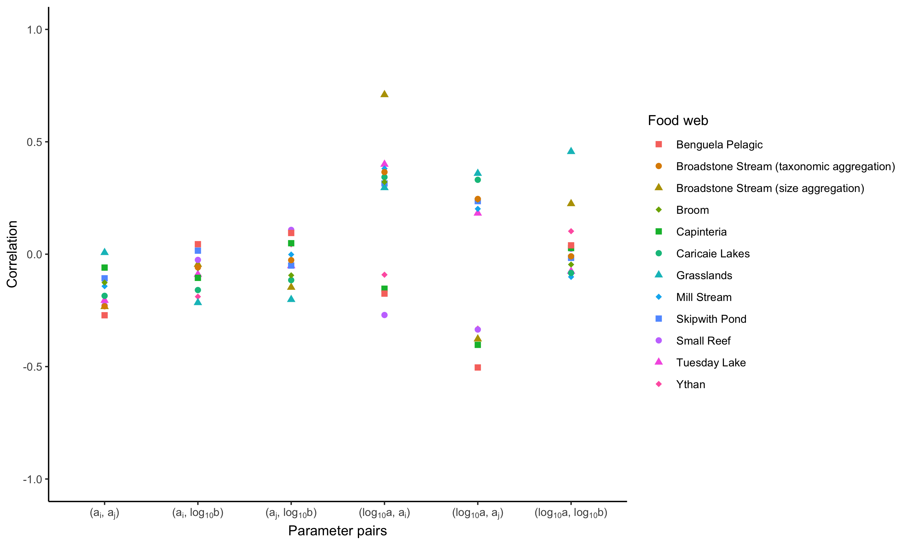

# ABC methods

In the upcoming sections, we explain the Markov chain Monte Carlo and sequential Monte Carlo used to parameterise the ADBM.

## Markov chain Monte Carlo ABC

Rejection ABC does not learn anything from rejection or acceptance events. It can therefore be inefficient, particularly when there is a high proportion of rejections. This may arise if prior distributions are wide and the observed data are informative as they may constrain the posterior distributions relative to the priors.

MCMC ABC attempts to overcome this shortcoming by learning from rejections and acceptances, and thereby focus tested sets of parameter values in regions of parameter space that have higher posterior probability, but still explore other parts of parameter space.

Based on @marjoramMarkovChainMonte2003, the MCMC method is as follows:

*Properties:*

As in rejection ABC except with the addition:

-   A proposal distribution $K(\theta | \theta')$ which is a normal distribution

*Initialisation:*

-   Run the rejection method to choose a set of parameter values from $\theta_0 \sim \pi(\theta)$ within the distance tolerance

*Sampling:*

for $i = 1 \dots n$

-   Simulate $\theta' \sim K(\theta_i | \theta_{i-1})$

-   Compute model result $x_i = model(\theta`)$

-   Compute summary statistics $s(x')$

-   Calculate $\alpha = \frac{K_h(d(s(x'), s(y))) \pi(\theta') K(\theta', \theta^{i-1})}{K_h(d(s(x^{i-1}), s(y))) \pi(\theta^{i-1}) K(\theta^{i-1}, \theta')}$

    -   Simulate $u \sim U(0,1)$

    -   If $u \leq \alpha$, $\theta^i = \theta'$ else, $\theta^i = \theta^{i-1}$

*Output:*

Construct posterior distribution using the correlated $\theta_1, \dots, \theta_n$.

### Burn in

There is a possibility that the posterior distribution is influenced by the initial set of parameter values $\theta_0$. We therefore discard the first half of Markov chain and use only the second half.

### Thinning

In the MCMC approach, the accepted parameter values are correlated as in some cases $\theta^i = \theta^{i-1}$; which reduces the independence of sampled parameter values in the posterior distribution. The Markov chains are thinned to reduce the dependence (autocorrelation \< 0.05) which lowers number parameter values in the posterior distribution. The chain length was chosen such that the chain length was approximately 1000 after thinning.

### Convergence

It is important to look into the convergence of the chains before drawing conclusions about the posterior distributions. The convergence was checked using Gelman-Rubin diagnostics. The value obtained from the Gelman-Rubin diagnostics should be less than 1.1 for convergence [@gelmanInferenceIterativeSimulation1992].

## Sequential Monte Carlo ABC

Sequential Monte Carlo ABC two main features: i. weighted resampling from the set of parameter values already drawn; ii. successive reduction in the distance threshold. This approach gives a set of posterior distribution where the successive posterior distribution is narrower than the previous one. SMC is more efficient than the rejection method when the posterior distribution is a lot narrower than the prior distribution. In SMC the parameters are uncorrelated and therefore do not require burn-in or assessment of convergence.

*Properties:*

As in rejection ABC except with the addition:

-   A proposal distribution $K(\theta | \theta')$ which is a normal distribution

-   A decreasing sequence of tolerance thresholds $\epsilon_1, \dots, \epsilon_T$

*Initialisation:*

At iteration $t = 1$,

-   for $i = 1, \dots, N$,

    -   until distance $d(S(x),S(y)) < \epsilon_1$

        -   simulate model parameter $\theta_i^{(1)} \sim \pi(\theta)$ and model output $x = model(\theta_i^{(1)})$.

-   Set equal probabilities $w_i^{1} = 1/N$ for parameter values.

-   Take variance of proposal distribution $\tau_2^2$ as twice the empirical variance of the $\theta_1^{(1)}$'s.

<!-- **OP: I have no idea what the bullets above mean! Needs to be explained if we want more readers to understand.** -->

*Sampling:*

At iteration $2 \leq t \leq T$,

-   for $i = 1, \dots, N$,

    -   until distance $d(S(x),S(y)) < \epsilon_t$

        -   pick $\theta^*_i$ from the $\theta_j^{(t-1)}$'s with probabilities $w_j^{(t-1)}$
        -   generate model parameter $\theta_i^{(t)} \sim K(\theta | \theta_i^*; \tau_t^2)$ and model output $x = model(\theta_i^{(t)})$.

    -   Set $$w_i^{(t)} \propto \frac{\pi (\theta_i^{(t)})}{\sum_{j=1}^N w_j^{t-1} K(\theta_i^{(t)} | \theta_j^{(t-1)}; \tau_t^2)} $$

    -   Take $\tau_{t+1}^2$ as twice the weighted empirical variance of the $\theta_i^{(t)}$'s

*Output:*

Construct a sequence of converging posterior distributions using the parameter values: $\theta_1^t, \dots, \theta_n^t$ for all $1 \leq t \leq T$


# Choice of threshold value of distance

```{r, echo=FALSE, fig.align='center', fig.pos="H", out.width="500px", fig.cap="\\label{fig:fig_CI_vs_dist}The prediction interval of the predicted connectance increases with increasing distance threshold. The green line and black line represent the observed connectance and mean of predicted connectance respectively."}

```


# Figure legends

Figure S1-S16: (a) Observed and predicted predation matrices of the given food web. Body size increases from left to right and top to bottom along the predation matrix. Black circles show where there were observed trophic links. The intensity of the pink circles shows the proportion of 1000 predicted food webs that had a trophic link between the corresponding species. This type of overlay is shown for two example predicted in panel (c). (b) The histogram of the number of times a link was predicted across the 1000 independently predicted food webs. The red bar shows the number of pairs of species for which a trophic link was never predicted. (c) Two predicted predation matrices correspond to the minimum and the maximum value of estimated $b$, and their sum.

Figure S17-S32: Marginal prior and marginal posterior distribution of the ADBM parameters for 16 food webs estimated using rejection ABC.

```{r fig_s0, echo=FALSE, fig.align='center', fig.pos="H", out.width="300px", fig.cap="Benguela Pelagic"}

```

```{r fig_s1, echo=FALSE, fig.align='center', fig.pos="H", out.width="300px", fig.cap="Broadstone Stream (taxonomic aggregation)"}
knitr::include_graphics("fig/Broadstone_Stream_pred_mat.png")
```

```{r fig_s1b2, echo=FALSE, fig.align='center', fig.pos="H", out.width="300px", fig.cap="Broadstone Stream (size aggregation)"}

```

```{r fig_s2, echo=FALSE, fig.align='center', fig.pos="H", out.width="300px", fig.cap="Broom"}

```

```{r fig_s3, echo=FALSE, fig.align='center', fig.pos="H", out.width="300px", fig.cap="Capinteria"}
knitr::include_graphics("../../results/rejection/Capinteria/rN=1000_tol=0.85_TSS_lower_a/pred_mat.png")
```

```{r fig_s4, echo=FALSE, fig.align='center', fig.pos="H", out.width="300px", fig.cap="Caricaie Lakes"}

```

```{r fig_s8, echo=FALSE, fig.align='center', fig.pos="H", out.width="300px", fig.cap="Grasslands"}

```

```{r fig_s9, echo=FALSE, fig.align='center', fig.pos="H", out.width="300px", fig.cap="Mill Stream"}

```

```{r fig_s11, echo=FALSE, fig.align='center', fig.pos="H", out.width="300px", fig.cap="Skipwith Pond"}

```

```{r fig_s12, echo=FALSE, fig.align='center', fig.pos="H", out.width="300px", fig.cap="Small Reef"}
knitr::include_graphics("fig/Small_Reef_pred_mat.png")
```

```{r fig_s13, echo=FALSE, fig.align='center', fig.pos="H", out.width="300px", fig.cap="Tuesday Lake"}

```

```{r fig_s14, echo=FALSE, fig.align='center', fig.pos="H", out.width="300px", fig.cap="Ythan"}

```

```{r fig_sa0, echo=FALSE, fig.align='center', fig.pos="H", out.width="300px", fig.cap="Benguela Pelagic"}

```

```{r fig_sa1, echo=FALSE, fig.align='center', fig.pos="H", out.width="300px", fig.cap="Broadstone Stream (taxonomic aggregation)"}

```

```{r fig_sa2, echo=FALSE, fig.align='center', fig.pos="H", out.width="300px", fig.cap="Broadstone Stream (size aggregation)"}

```

```{r fig_sa3, echo=FALSE, fig.align='center', fig.pos="H", out.width="300px", fig.cap="Broom"}

```

```{r fig_sa4, echo=FALSE, fig.align='center', fig.pos="H", out.width="300px", fig.cap="Capinteria"}

```

```{r fig_sa5, echo=FALSE, fig.align='center', fig.pos="H", out.width="300px", fig.cap="Caricaie Lakes"}

```

```{r fig_sa9, echo=FALSE, fig.align='center', fig.pos="H", out.width="300px", fig.cap="Grasslands"}

```

```{r fig_sa10, echo=FALSE, fig.align='center', fig.pos="H", out.width="300px", fig.cap="Mill Stream"}

```

```{r fig_sa12, echo=FALSE, fig.align='center', fig.pos="H", out.width="300px", fig.cap="Skipwith Pond"}

```

```{r fig_sa13, echo=FALSE, fig.align='center', fig.pos="H", out.width="300px", fig.cap="Small Reef"}

```

```{r fig_sa14, echo=FALSE, fig.align='center', fig.pos="H", out.width="300px", fig.cap="Tuesday Lake"}

```

```{r fig_sa15, echo=FALSE, fig.align='center', fig.pos="H", out.width="300px", fig.cap="Ythan"}

```

<!-- A paragraph on method comparison -->

# Comparison between methods

We found consistent results among all three ABC methods (Fig. \ref{fig:fig_r66}). The marginal posteriors of the ADBM parameters estimated using the three ABC methods for the Benguela Pelagic food web were quite similar in Fig. \ref{fig:fig_r65}. In terms of simplicity, rejection ABC was the easiest to implement and resulted in similar results as the MCMC ABC and SMC ABC. To achieve similar number of accepted parameter values, MCMC ABC required a higher number of simulations, as MCMC ABC resulted in correlated parameter values and needed to be thinned. MCMC ABC was the most time consuming method. The SMC ABC method helped us to understand how the parameter distribution converged in response to the decrease in tolerance.

```{r fig_r65, echo=FALSE, fig.align='center', fig.pos="H", out.width="300px", fig.cap="\\label{fig:fig_r65}Marginal posterior distributions of the ADBM parameters estimated from rejection ABC, MCMC ABC and SMC ABC for Benguela Pelagic food web."}
knitr::include_graphics("../../results/misc/Benguela_Pelagic_comp_method.png")
```

```{r fig_r66, echo=FALSE, fig.align='center', fig.pos="H", out.width="400px", fig.cap="\\label{fig:fig_r66}The 95\\% credible intervals of marginal posterior distributions of the ADBM parameters estimated from rejection ABC, MCMC ABC and SMC ABC for 16 food webs."}

```

# Model parameters

In the ADBM, the contingency model of optimal foraging predicts the diet $k$ of each consumer $j$ that maximises rate of energy intake given below:

$\frac{\sum_{i=1}^k \lambda_{ij} E_i}{1 + \sum_{i=1}^k \lambda_{ij}H_{ij}}$

$\frac{\sum_{i=1}^k A_{ij}N_i E_i}{1 + \sum_{i=1}^k A_{ij}N_iH_{ij}}$

$\frac{\sum_{i=1}^k aM_i^{a_i}M_j^{a_j}nM_i^{n_i} eM_i}{1 + \sum_{i=1}^k aM_i^{a_i}M_j^{a_j}nM_i^{n_i}\frac{h}{b - \frac{M_i}{M_j}}}$

$\frac{\sum_{i=1}^k naeM_i^{a_i+n_i+1}M_j^{a_j}}{1 + \sum_{i=1}^k nahM_i^{a_i+n_i}M_j^{a_j}\frac{1}{b - \frac{M_i}{M_j}}}$

Since, the maximum of the above expression is affected by the product $nah$, it is sufficient to estimate only one of the parameters from $nah$, so we estimated only $a$. Also, parameter $e$ does not affect the value of $k$ where the above expression has a maximum so value of $e$ can be arbitrary.

# Prior selection of a

```{r fig_prior, echo=FALSE, fig.align='center', fig.pos="H", out.width="300px", fig.cap="\\label{fig:fig_prior}True skill statistics between the observed and predicted food web for Benguela Pelagic food web plotted against the attack rate scaling parameter $a$ which is in log scale. The red lines represent the boundaries for the prior range of $log_{10}(a)$."}

```


# Parameter correlations

```{r fig_par_cor, echo=FALSE, fig.align='center', fig.pos="H", out.width="500px", fig.cap="\\label{fig:fig_par_cor}True skill statistics between the observed and predicted food web for Benguela Pelagic food web plotted against the attack rate scaling parameter $a$ which is in log scale. The red lines represent the boundaries for the prior range of $log_{10}(a)$."}

```

# Principal Component Analysis on structural properties

```{r echo=FALSE, warning=FALSE}
library(readxl)
library(knitr)
library(kableExtra)
PCA_table <- readRDS("../../results/misc/PCA_properties.RDS")
kable(PCA_table, caption = "Variance in structural properties explained by the first three principal compenents and correlation between connectance and first principal component.") %>%
  landscape(margin = "1cm")
  
```


# Summary table of linear regression between average standardized error and true skill statistic from Figs \ref{fig:fig_r6} and \ref{fig:fig_r7}

## Benguela Pelagic

```{r echo = FALSE}
smry_data <- readRDS(file = "../../results/misc/summary_SE_vs_TSS_lm.RDS")

print(smry_data[[1]]$summary)
```

## Broadstone Stream (taxonomic aggregation)

```{r echo = FALSE}
smry_data <- readRDS(file = "../../results/misc/summary_SE_vs_TSS_lm.RDS")

print(smry_data[[2]]$summary)
```

## Broadstone Stream (size aggregation)

```{r echo = FALSE}
smry_data <- readRDS(file = "../../results/misc/summary_SE_vs_TSS_lm.RDS")

print(smry_data[[12]]$summary)
```

## Broom

```{r echo = FALSE}
smry_data <- readRDS(file = "../../results/misc/summary_SE_vs_TSS_lm.RDS")

print(smry_data[[3]]$summary)
```

## Capinteria

```{r echo = FALSE}
smry_data <- readRDS(file = "../../results/misc/summary_SE_vs_TSS_lm.RDS")

print(smry_data[[4]]$summary)
```

## Caricaie Lakes

```{r echo = FALSE}
smry_data <- readRDS(file = "../../results/misc/summary_SE_vs_TSS_lm.RDS")

print(smry_data[[5]]$summary)
```

## Grasslands

```{r echo = FALSE}
smry_data <- readRDS(file = "../../results/misc/summary_SE_vs_TSS_lm.RDS")

print(smry_data[[6]]$summary)
```

## Mill Stream

```{r echo = FALSE}
smry_data <- readRDS(file = "../../results/misc/summary_SE_vs_TSS_lm.RDS")

print(smry_data[[7]]$summary)
```

## Small Reef

```{r echo = FALSE}
smry_data <- readRDS(file = "../../results/misc/summary_SE_vs_TSS_lm.RDS")

print(smry_data[[9]]$summary)
```

## Tuesday Lake

```{r echo = FALSE}
smry_data <- readRDS(file = "../../results/misc/summary_SE_vs_TSS_lm.RDS")

print(smry_data[[10]]$summary)
```

## Ythan

```{r echo = FALSE}
smry_data <- readRDS(file = "../../results/misc/summary_SE_vs_TSS_lm.RDS")

print(smry_data[[12]]$summary)
```

```{r, echo=FALSE, fig.align='center', fig.pos="H", out.width="500px", fig.cap="\\label{fig:fig_par} The 95\\% credible intervals of marginal posterior distributions of the ADBM parameters estimated from rejection ABC, MCMC ABC and SMC ABC for 16 food webs." }
knitr::include_graphics("fig/par.png")
```


```{r, echo=FALSE, fig.align='center', fig.pos="H", out.width="500px", fig.cap="\\label{fig:fig_r6} The mean standardised error of the food web properties predicted from the ADBM parameterised using rejection ABC plotted against the true skill statistic for each food webs. The solid lines are linear regressions (details in SI-S5)." }

```

```{r, echo=FALSE, fig.align='center', fig.pos="H", out.width="500px", fig.cap="\\label{fig:fig_r7}The mean standardised error of the food web properties predicted from the ADBM parameterised using rejection ABC plotted against the true skill statistic for each food webs. The solid lines are linear regressions (details in SI-S5). The limits of the horizontal and vertical axes have been set between 0 and 1." }

```

```{r, echo=FALSE, fig.align='center', fig.pos="H", out.width="500px", fig.cap="\\label{fig:fig_r8}The mean standardised error in structural properties of food web versus mean standardised error in connectance. Solid blue line is linear regression (t = 3.911, df = 10, P = 0.0029)" }

```


# References
