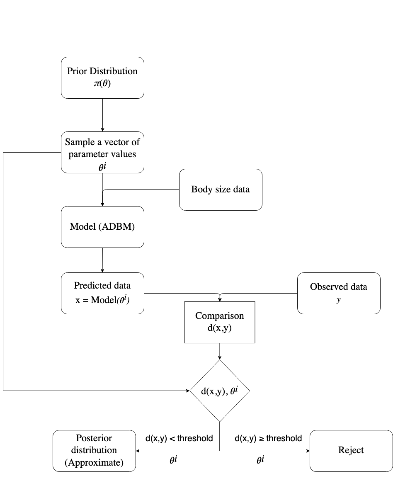
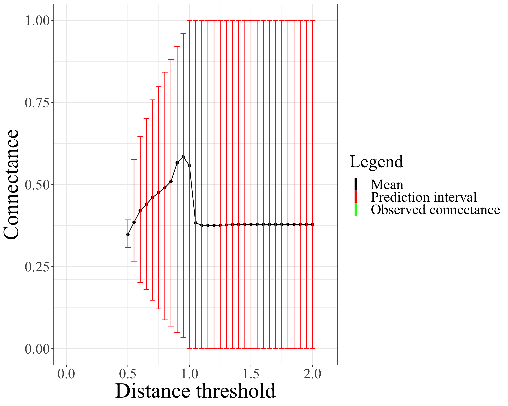
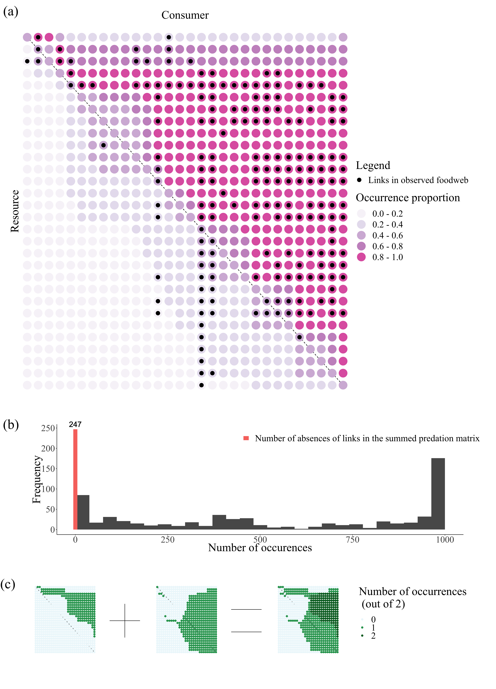
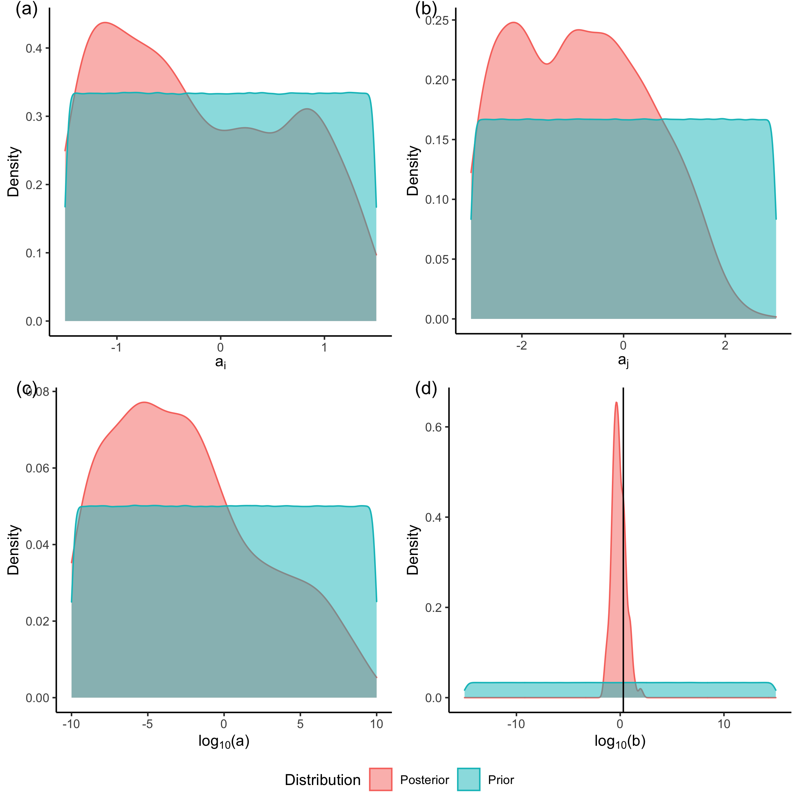
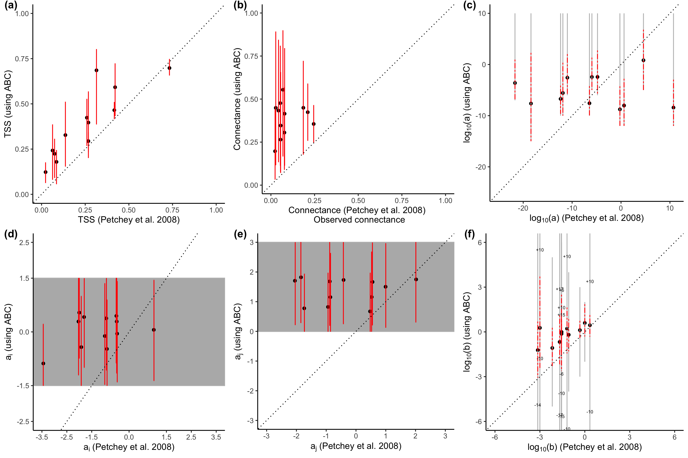
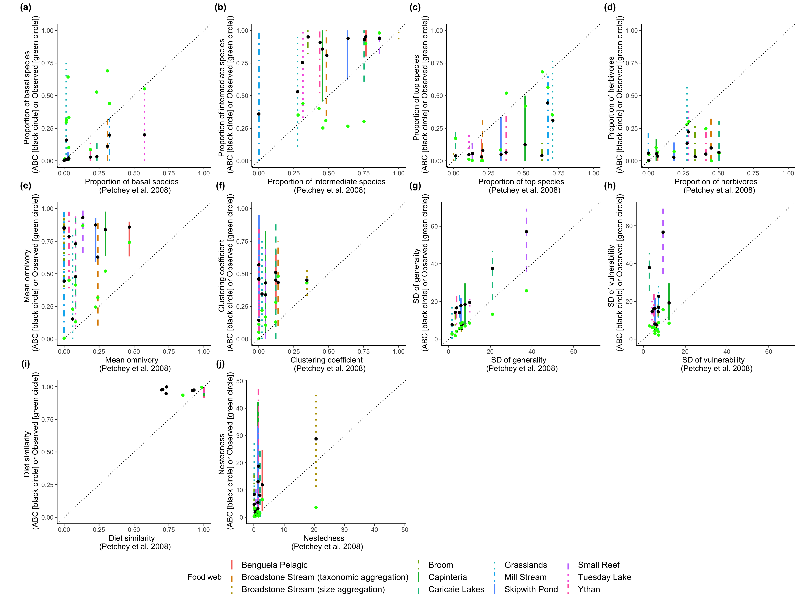
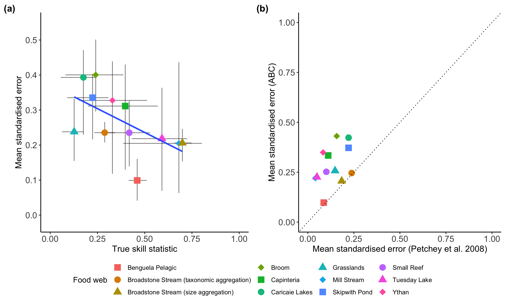

# Introduction

Knowledge about the trophic interactions among the organisms in a community is crucial for understanding the structure and dynamics of ecological communities and for predicting their response to environmental change [@dunneNetworkStructureBiodiversity; @tylianakisEffectsGlobalEnvironmental2014; @oconnorWarmingResourceAvailability2009; @bergaminoFoodWebStructure2011; @krauseCompartmentsRevealedFoodweb2003; @lurgiClimateChangeImpacts2012; @morrisFoodWebStructure2015]. The network of trophic interactions is often referred to as a food web. The food web structure can provide answers to key ecological questions: which species are more vulnerable to environmental changes such as temperature [@petcheyEnvironmentalWarmingAlters1999]; how robust a food web is to extinctions [@dunneNetworkStructureBiodiversity]; and how a food web reacts if the predators are removed [@knightTrophicCascadesEcosystems2005]?

Trophic interactions information from multiple sources can be used to infer a food web, e.g. gut contents [@peralta-maraverStructureDynamicsStability2016a] and cannot be assigned with certainty to a specific prey item [@bakerFishGutContent2014]. With stable isotope ratios of tissues, uncertainty may be due to factors such as variability in the isotopic fractionation values across multiple combinations of diets and tissues/species, unquantified temporal or spatial variation in prey isotopic values, and variation caused by routing of particular dietary nutrients into particular tissues [@crawfordApplicationsStableIsotope2008]. Furthermore, complete recording of all interactions usually requires a large sampling effort even at small spatial and temporal scales [@hobsonUsingStableIsotopes1994]. Food web structure is very difficult to record at larger spatial and temporal scales without losing resolution (spatial, temporal, and taxonomic) [@gravelInferringFoodWeb2013; @martinezArtifactsAttributesEffects1991; @jordanSensitivityFoodWeb2009]. Less than complete sampling of interactions can result in no interaction being observed between a pair of individuals that in fact do interact, which results in missing links in a food web. Due to under-sampling, food webs can be poorly understood, which may hinder further advances in the field [@martinezEffectsSamplingEffort1999].

When interactions are difficult to observe, and hence well-documented food webs are not available, models which predict species interactions may provide a solution [@tamaddoni-nezhadConstructionValidationFood2013; @gravelInferringFoodWeb2013; @petchey2008size; @allesinaGeneralModelFood2008; @cohenStochasticTheoryCommunity1985]. A food web model can be used to predict missing information about species interactions. For example, @petchey2008size showed how a model of species interactions (and therefore food web structure) could be parameterised from data on the known presence and absence of trophic interactions. The model and its parameter values encode the rules for occurrence or absence of species interactions to predict food web structure. Observed data may be used to select and parameterise the model. @tamaddoni-nezhadConstructionValidationFood2013 used large agricultural datasets, logic-based machine learning and text mining to assign interactions between nodes to automatically construct food webs. @gravelInferringFoodWeb2013, inspired by the niche model of food web structure developed a method that used the statistical relationship between predator and prey body size to infer the food web.

Food web models are also useful for ecological forecasting. @lindegrenEcologicalForecastingClimate2010 used a stochastic food web model driven by regional climate scenarios to produce quantitative forecasts of cod dynamics in the twenty-first century. @hattabForecastingFinescaleChanges2016 forecasted the potential impacts of climate change on the local food web structure of the highly threatened Gulf of Gabes ecosystem, located in the south of the Mediterranean Sea. Hence, food web models have an important role in filling gaps in knowledge about species interactions, including predicting future changes in food web structure.

The allometric diet breadth model (ADBM) was the first model able to predict food web connectance and structure [@beckermanForagingBiologyPredicts2006; @petchey2008size]. It uses foraging theory, specifically the contingency model [@macarthurOptimalUsePatchy1966], to predict the diet of each potential consumer and thereby the food web structure (further details are in the Material and Methods section). <!-- This set is the prey species that maximises the energy intake rate of the predator. The model requires the foraging related traits of species, such as energy content of a potential prey item, the rate of space clearance (also known as attack rate), the density of prey items, and handling time (the amount of time required to handle food items). The model is termed "allometric" because each of these quantities is derived from the body size of the prey and predator using several allometric relationships. The ADBM has also been used to investigate the effect of temperature on an observed food web structure [@ogormanSimpleModelPredicts2019].A comparison of the ADBM with other food web models has been discussed in @petcheyFitEfficiencyBiology2011. --> The ADBM had variable success in explaining the structure of 15 different food webs, with the proportion of links correctly predicted ranging from 5 % to 65 % (Table \ref{fig:tab_1}). The ADBM correctly predicted 65% of the presence of links in the Coachella valley food web. The poorest prediction of presence of links was for the Grasslands food web with only 7% of the presence of links correctly predicted. When trophic interactions were more strongly dependent on size, the model correctly predicted a greater proportion of links. Indeed, constructing a food web based only on body size (i.e. ignoring taxonomy) resulted in almost twice the number of correctly predicted links, i.e. 83%, in contrast to taxonomy [@woodwardChapterIndividualBasedFood2010].

Although @petchey2008size demonstrated that foraging theory could predict food web structure, their implementation of the ADBM included at least two limitations. The parameterisation method provided estimates of the parameters with no uncertainty: a single set of parameter values that maximised the explanatory power was selected. In other words, the parameterisation method led to point estimates of the parameters that predicted a single food web structure (because the ADBM is purely deterministic). Moreover, the best predicted food web was not exactly the same as the observed one. In a sense then, the parameterisation method used in @petchey2008size was akin to estimating the intercept and slope of a regression line, but not any uncertainty in those parameters. Given that uncertainty is an essential dimension in ecological models, and in predictions about the future state of ecological communities [@petcheyEcologicalForecastHorizon2015; @carpenterEcologicalFuturesBuilding2016], this is an important limitation.

The second limitation was in the estimation of the connectance of the food web, which is the number of realised trophic links divided by the total number of possible trophic links. Although the ADBM can in principle predict connectance, @petchey2008size prevented the model from doing so. They set the value of relevant parameters in the model to instead ensure the predicted connectance was equal to the observed connectance. The ADBM was not therefore used to simultaneously predict connectance and structure of food webs. Moreover, fixing predicted connectance to be equal to observed connectance does not account for the possibility that the observed connectance was imperfectly measured. Indeed, if low effort was used to observe the trophic links in a community, the observed connectance are likely to be lower than if all trophic links were observed. Connectance is an important driver for the stability and dynamics of a food web [@mayWillLargeComplex1972] and most of the structural properties of food webs co-vary with connectance [@dunneNetworkStructureBiodiversity; @poisotWhenEcologicalNetwork2014], thus this limitation must be addressed.

In this article we report on how we address these limitations. We removed the first limitation by applying approximate Bayesian computation (ABC). The approach originated in population genetics and has been used in a wide range of research fields: systems biology [@toniApproximateBayesianComputation2009], ecology [@jabotInferringParametersNeutral2009], epidemiology [@shrinerEvolutionIntrahostHiv2006] and ecological networks [@ibanezOptimizingSizeThresholds2012; @poisotHowEcologicalNetworks2016]. One of the advantages of ABC is that it does not require a likelihood function. As ADBM is a complex deterministic model where the likelihood can not be explicitly evaluated, ABC is a good choice of parameterisation.

We addressed the second limitation by allowing estimation of number of links as well as arrangement of links. To accomplish this, we measured model fit by using the true skill statistic, which takes into account both the number of presences and absences of links correctly predicted. High values of the true skill statistic occurs when both the predicted arrangement of links and the predicted number of links are close to the observed arrangement and number of links, respectively.

```{r echo=FALSE, warning=FALSE}
library(readxl)
library(knitr)
library(kableExtra)
fw_table <- read_excel("table/fw_table.xlsx")
kable(fw_table, format = "latex",
      caption = "\\label{fig:tab_1}Information about the food webs predicted using the ADBM.", escape = FALSE, align = "l") %>%
  kable_styling(font_size = 7, latex_options="scale_down", row_label_position = 1) %>%
  landscape(margin = "1cm") %>%
  column_spec(1, width = "3cm") %>%
  column_spec(2, width = "8em") %>%
  column_spec(7, width = "8em") %>%
  column_spec(8, width = "8em") %>%
  column_spec(9, width = "8em")
  
```

# Materials and Methods

In the upcoming sections, we present a detailed account of the application of ABC to parameterise the ADBM, the description of the ADBM and of the food web data we used. We explain the rejection Monte Carlo ABC method in the main text, and Markov chain Monte Carlo ABC and sequential Monte Carlo ABC methods in the Supplementary information (hereafter SI) Section S1 (hereafter SI-S1). We computed an accuracy measure known as true skill statistic to assess the ADBM's predictions and calculated different food web properties to compare these predictions across food webs.

## Allometric Diet Breadth Model (ADBM)

The allometric diet breadth model (ADBM) is based on optimal foraging theory, specifically the contingency foraging model [@macarthurOptimalUsePatchy1966]. The ADBM predicts the set of prey species a consumer should feed upon to maximise its rate of energy intake [@petchey2008size] (hereafter referred as PBRW study). The species in this set are assumed to have the trophic link with the predator. To make these predictions, the model assumes that a foraging predator is in one of two exclusive states: searching for prey or handling a prey item. The model requires four variables for each potential predator-prey interaction:

-   The energy content of the resources $E_i$ (only prey $i$ specific) (energy).
-   The handling times $H_{ij}$, which is the time not spent searching caused by consuming a prey item (prey $i$ and predator $j$ specific) (time).
-   The space clearance rates $A_{ij}$ (also known as the attack rate; prey $i$ and predator $j$ specific) (area or volume per time).
-   The prey densities $N_i$ (only prey $i$ specific) (individuals per area or volume).

The term "Allometric" in the ADBM refers to the use of four allometric relationships, one for each of these four variables, including the body size of the predator $M_j$ and prey $M_i$ (Table \ref{fig:tab_2}). With these four allometric relationships, and the body size of each of the species in a community, we can predict the four variables (energy, handling time, space clearance rate, and prey density), and then use the contingency foraging model to predict diets.

Each of the four allometric equations has parameters: a constant and/or at least one exponent (Table \ref{fig:tab_2}). It is the value of some of these parameters that can be estimated to have the predicted food web structure match (as closely as possible) the structure of an observed food web. This is akin to choosing values of slope and intercept of a linear regression that maximises the fit of the regression line to the observed data.

Because some of the allometric constants and exponents are known, and because others are redundant with respect to each other (see Table \ref{fig:tab_2} for details), we estimate only the following parameters: $a$, $a_i$, $a_j$ and $b$ in the model (Table \ref{fig:tab_2}).

```{r echo = FALSE, warning = FALSE}
options(knitr.kable.NA = '')
library(readxl)
library(knitr)
library(kableExtra)
fw_table <- read_excel("table/adbm_table.xlsx")

kable(fw_table, format = "latex",
      caption = "\\label{fig:tab_2}Traits with their allometric function and corresponding parameters in ADBM.",
      escape = FALSE) %>%
    kable_styling(latex_options="scale_down")


```

In the ADBM, some species can be predicted to eat others, but to not be eaten by others, i.e. be predicted to be a top predator. This can occur for relatively large species when the exponent $b$ is less than 1, which can cause the handling time of this large species to be infinite for all potential consumer species.

## Observed food web data

The observed food webs that we fit the ADBM to belong to marine, freshwater and terrestrial ecosystems (Table \ref{fig:tab_1}). The observed connectance of these food webs is from 0.02 to 0.34 and there are 19 to 158 species. The food webs contain primary producers, herbivores, carnivores, parasites, and parasitoids. They also contain various types of feeding interactions, including predation, herbivory, bacterivory, parasitism, pathogenic, and parasitoid.

The goodness of fit of the ADBM's predictions depends on the types of interactions in the food webs in the PBRW study. Because some of the interactions are more size structured than other interactions. Predacious and aquatic herbivore interactions were predicted better than parasitoid and herbivory ones (PBRW study).

All food webs with one exception (Broadstone Stream) was available only at the species level, i.e. with information about interactions between species and the body size of species. We use the term "species" in this study to indicate a "node" in a food web in which nodes are connected by trophic interactions, and nodes are a collection of individuals that share links. These species/nodes are not always taxonomic species, but can be broader taxonomic ranks.

In contrast, the Broadstone Stream food web data contained interactions between individuals and the individual body sizes. Thus, the Broadstone Stream food web can be constructed by aggregating by either taxonomy or size [@woodwardChapterIndividualBasedFood2010].

## Parameter estimation: Approximate Bayesian Computation

We used approximate Bayesian computation (ABC) to identify sets of parameter values that resulted in predicted food webs that were close in structure to the observed food web. ABC is an approach that does not require a likelihood function. Instead, there is a distance function that measures the distance between a model's prediction and the observed data. The approximation of the likelihood depends on the ABC method used, which is further discussed below and SI. The model parameter values are sampled from a prior distribution. The accepted parameter values form an approximate posterior distribution for the model parameter. We implemented three ABC methods to parameterise the ADBM: namely rejection Monte Carlo (Fig. \ref{fig:fig_m1}), Markov chain Monte Carlo, and sequential Monte Carlo. The three methods produced very similar results (SI Figs S33-S34) and we therefore only include the simplest (rejection) in this main text.

```{r, echo=FALSE, fig.align='center', out.width="400px", fig.cap="\\label{fig:fig_m1} Flowchart of rejection approximate Bayesian computation method implemented to parameterise the ADBM."}

```

### Prior distribution

The prior distributions for $a_i$ and $a_j$ were chosen to be uniform distributions. The range of distribution was from -1.5 to 1.5 and 0 to 3 for $a_i$ and $a_j$ respectively, informed by the estimates in @rallUniversalTemperatureBodymass2012. However, we chose a prior range specific to food webs for the parameter $b$ because body size varies greatly among the species in the observed food webs. For example: in the Benguela Pelagic food web, the body sizes of species range from the order of $10^{-8}$ gm to $10^5$ gm. Hence, the range of prey-predator ratio was from the order of $10^{-14}$ to $10^{14}$. To take this into account, we took the prior of $log_{10}(b)$ from a uniform distribution ranging from $-15$ to $15$. In the case of parameter $a$, we chose the prior of $log_{10}(a)$ to be a uniform distribution. However, the prior range varied between food webs. For example, the prior range for Benguela Pelagic was chosen to be -12 to 10.

For the prior of $a$, we chose the prior of $log_{10}(a)$ to be a uniform distribution. Since, the ADBM estimated connectance to be higher than the real connectance, lower values of $a$ were favoured in the parameterisation. Hence, the upper bound of the prior was set to 10. To set the lower bound, we investigated how the true skill statistic varied with $log_{10}(a)$ (e.g. SI Fig. S35). We found that the TSS increased with decreasing $log_{10}(a)$ and then remained constant, for a constant value of $log_{10}(b)$. We therefore decided to set the lower bound of $log_{10}(a)$ such that the maximum variation of TSS was taken into account, while attempting to keep the range of prior as small as possible. In the case of Benguela Pelagic as shown in SI Fig. S35, the lower bound of $log_{10}(a)$ was taken to be -12.

### Comparison of observed and predicted

The difference between the model's prediction and the observed data (e.g. the sum of squared residuals is such a distance in linear regression) is quantified by a distance measure. The distance is lower when there is a closer match between the model's prediction and the observation. A perfect match would result in zero distance.

The magnitude of the distance is used for the acceptance or rejection of a set of parameter values. An accepted set of parameter values contributes to the posterior distribution, rejected ones do not. This makes the distance measure one of the important features of ABC. A threshold distance is chosen, and if the distance for a particular set of parameter values is less than the threshold, then that set of parameter values contributes to the posterior distribution. When the distance is greater than the threshold, the parameter values do not contribute to the posterior. Hence, the magnitude of the distance threshold determines the proportion of a model's parameters that are accepted. A higher threshold causes a high proportion of acceptances but less accuracy with the acceptance of some parameter sets that result in predictions quite unlike the observed data. Below, we first describe and justify our choice of distance measure, and then our choice of threshold.

#### Choice of distance measure

In the PBRW study the measure of distance was equivalent to $1 - TP / (TP + FN)$, where $TP$ is the number of observed links that were predicted (the number of true positives) and $FN$ is the number of observed links that were not predicted (the number of false negatives). A distance of 0 indicates that all observed links were correctly predicted. One way for the ADBM to achieve this is to predict that every species has a trophic link with every other species including itself -- a fully connected food web with connectance of 1. The PBRW study prevented this by constraining the number of predicted links to be equal to the number of observed links, i.e. the model connectance was fixed to be the same as the observed connectance. In this study, we relaxed this constraint, with the number of links as well as the arrangement of links being estimated. The first step was to choose an appropriate distance measure.

The distance measure used in this study is 1 minus the true skill statistic: $\text{distance} = 1 - \text{TSS}$. This distance ranges from 0 to 2.

TSS is defined as:

$$ \text{TSS} = \frac{TP\cdot TN- FP \cdot FN}{(TP+FN)(FP+TN)} $$ where $TP$ is the number of observed links that are predicted by the model (true positives), $TN$ is the number of observed absences of links that are correctly predicted (true negatives), $FP$ is the number of false positives, and $FN$ is the number of false negatives.

The $TSS$ ranges from $-1$ to $1$, where +1 indicates a perfect prediction. A $TSS$ value of zero or less indicates a performance no better than random.

The inclusion of true and false negatives in the distance measure means that the best theoretically possible prediction (smallest distance) is a unique prediction, and specifically the one in which the predicted presence and absence of links matches exactly with the observed presence and absence of links.

#### Choice of threshold value of distance

Food web dynamics and stability are strongly dependent on connectance [@mayWillLargeComplex1972], we therefore set the distance threshold (for acceptance) such that the model had a reasonable chance of predicting the observed value of connectance. Note that in the following section (*The Rejection ABC method*) we use the term $tol$ to denote the value of the distance threshold.

To do this, we examined how the predicted connectance varied with the distance threshold. An example of this relationship is given in Fig. \ref{fig:fig_m2} for the Benguela Pelagic food web and in SI. Fig. S1 for other food webs. We chose the minimum threshold value that gave a range of predicted connectance containing the observed connectance.

Furthermore, it is useful to note that in Fig. \ref{fig:fig_m2} there are no connectance values below a distance threshold value of less than 0.5 because for this particular food web there were no sets of parameter values that achieved a better model fit than is indicated by $1-TSS = 0.5$. I.e. it is impossible for the ADBM to make better predictions than this. One reason for this is that the ADBM, when body size is the only trait, can only predict contiguous diets in trait space, whereas the observed data contains gaps in the diet.

```{r, echo=FALSE, fig.pos="h", fig.align='center', out.width="300px", fig.cap = "\\label{fig:fig_m2}The prediction interval of the predicted connectance increases with increasing distance threshold for the Benguela Pelagic food web. The green line and black line represent the observed connectance and mean of predicted connectance respectively."}

```

### The Rejection ABC method

In the rejection ABC method, a set of parameter values are sampled from the prior distributions. This set of parameter values is either accepted, and thereby added to the posterior distribution of the parameter values, or it is rejected (based on if the distance 1 - $TSS$ is less than or greater than the threshold distance, as mentioned above). This process is repeated until there are enough acceptances to give stable (approximate) posterior distributions. In addition, we used a kernel function that assigns weight to each set of parameter values, where the weight is inversely proportional to the distance (1 - $TSS$).

In the upcoming section, we further detail the rejection ABC method.

*Properties:*

-   A prior distribution $\pi(\theta)$: $\pi$ is the uniform distribution for parameters $\theta = (a, a_i, a_j, b)$

-   A model prediction $model(\theta)$: ADBM$(\theta)$. This is a predicted food web, $x_i$, given by a particular set of parameter values $\theta_i$. Hence, $x_i = ADBM(\theta_i)$

-   A summary statistic $s(x)$: $x$ is the predation matrix predicted by the ADBM.

-   $\begin{aligned} \text{A kernel function } K(u): \text{ epanechnikov } K(u) &= \frac{1}{tol}\cdot\frac{3}{4}(1-(\frac{u}{tol})^2) \text{ if } u \leq tol \\ &= 0 \text{ otherwise} \end{aligned}$

where $tol$ is the distance threshold

-   A distance function $d(x_i,y)$: $d(x_i,y) = 1 - TSS(x_i,y)$

-   An observed food web $y$, in the form of a predation matrix containing zeros and ones.

*Sampling:*

for $i = 1 \dots n = 1000$

-   Draw a set of parameter values $\theta_i$ from the prior distribution $\pi(\theta)$.

-   Compute the model result $x_i = model(\theta_i)$

-   Compute $s(x_i)$ and $d(s(x_i), s(y))$

-   Accept or reject the parameter set probabilistically:

    -   Assign a probability $p_i$ to $\theta_i$ as per the kernel $K$; $p_i = \frac{K(d)}{K(0)}$, where $d$ is the distance evaluated in the previous step.

    -   Compute $\alpha \sim U(0,1)$

    -   If $\alpha \leq p_i$, then accept $\theta_i$ and $i = i + 1$

*Output:*

An approximate joint posterior distribution using the accepted $\theta_1, \dots, \theta_n$.

## Assessment of model fit

Accuracy is how close the model prediction is to the observation. The ADBM's prediction is a predation matrix that consists of the presence and absence of links thus comparing how close the prediction is to the observation is not straightforward as comparing two numerical values. We defined the accuracy of the ADBM using true skill statistics to take into account the true and false predictions of both the presence and absence of links, which is defined above.

We examined how closely structural properties of the predicted food web matched those of the observed food webs using the R *cheddar* package [@hudsonCheddarAnalysisVisualisation2013]. We evaluated properties such as proportion of basal species, proportion of intermediate species, proportion of top species, proportion of herbivores, mean omnivory, clustering coefficient, standard deviation of generality, standard deviation of vulnerability, diet similarity, mean path length and nestedness. We could not compute mean trophic level and maximum trophic level because the networks had lot of paths which were too many to compute for the R *cheddar* package for all the food webs.

We investigated the performance of the ADBM parameterised with the ABC by computing standardised error of the food web properties, where the standardised error is the absolute raw error (the difference between observed and predicted value) divided by the maximum absolute raw error for that property. We did not calculate the standardised error for mean omnivory and mean path length because it had some NA values and infinite values for all the food webs respectively.

# Results

As an example of the model outcomes, we first present the results for the Benguela food web (e.g. predicted food web structure, variation in predicted food web structure, and posterior parameter distributions). We chose this food web as it was well explained using the method of Petchey et al (2008) (hereafter referred as PBRW study). The results of the other food webs are included in the SI Figs S1-S32. We then compare model outcomes across all empirical food webs between the PBRW study and our current work. We compare the true skill statistic of the two approaches and compare some food web properties, such as proportions of basal, intermediate, and top species.

<!-- ## Exemplary results (Benguela food web) -->

The true skill statistic (TSS) of the predicted Benguela Pelagic food web varied between 0.4 and 0.52. This variation in the TSS is represented in terms of predation matrices displayed in Fig. \ref{fig:fig_r1}(a), which overlays 1000 independent predation matrices accepted from the ABC method. In all the 1000 independent predation matrices, the predicted links are mostly present in the upper triangular portion of the matrix where most of the observed links are also present. Links in the upper right triangle of the predation matrix are for predators feeding on prey smaller than themselves.

In the 1000 predicted predation matrices, there predators are sometimes smaller than their predicted prey, the links in the lower left triangle of the predation matrix. This is also portrayed in the marginal distribution of $log_{10}(b)$ in Fig. \ref{fig:fig_r3}(d), as it includes values greater than $b=2$ ($log_{10}(b)=0.3$). This is relevant as values of $b=2$ make the most profitable prey item equal in size to the predator size. Lower values of $b$ make the most profitable prey item smaller than the size of the predator.

There were around 250 potential links in the lower left triangle of the predation matrix that were never predicted in any of the 1000 predicted predation matrix (Fig. \ref{fig:fig_r1}(b)). This strongly suggests that the predator-prey size ratio of these links is so small (i.e. very large prey, very small predator) that the links cannot occur, given that the preponderance of observed links are predators consuming prey smaller than themselves.

```{r, echo=FALSE, fig.align='center', out.width="300px", fig.cap="\\label{fig:fig_r1} (a) Observed and predicted predation matrices for Benguela Pelagic food web. Body size increases from left to right and top to bottom along the predation matrix. Black circles show where there is an observed trophic link. The intensity of the pink circles shows the proportion of 1000 predicted food webs that had a trophic link between the corresponding species. This type of overlay is shown for two examples predicted in panel (c). (b) The histogram of the number of times a link was predicted across 1000 independently predicted food webs. There were 841 species pairs in this food web. About 150 of these were predicted to have a trophic link in all 1000 predicted predation matrices. The red bar shows the number of pairs of species for which a trophic link was never predicted. (c) Two predicted predation matrices for Benguela Pelagic food web corresponding to the minimum and the maximum value of estimated $b$, and their sum."}

```

The marginal posterior of parameter $b$ in the Benguela Pelagic food web was more constrained than the marginal posterior distribution of the other three allometric parameters (Fig. \ref{fig:fig_r3}) as the posterior range was the narrowest.

```{r, echo=FALSE, fig.align='center', out.width="300px", fig.cap="\\label{fig:fig_r3} Marginal prior and marginal posterior distribution of the ADBM parameters for the Benguela Pelagic food web estimated using rejection ABC. The black vertical line in (d) corresponds to the value of $b$ (=2) above which the most profitable prey item is larger in respect to the predator size."}

```

<!-- ## Comparison with Petchey et al. (2008) -->

```{r, echo=FALSE, fig.align='center', out.width="500px", fig.cap= "\\label{fig:fig_r2} TSS (a), connectance (b) and ADBM parameters (c, d, e, f) computed using the ABC method compared with the corresponding point estimates from Petchey et al (2008). The red lines are the 95\\% credible/prediction intervals and the black filled circles represent the corresponding means. The grey region represents the intervals of the prior distributions for $a_i$ and $a_j$. The grey lines represent the prior range of the parameters $a$ and $b$ in the $log_{10}$ scale. The prior range for the parameter $b$ extends above and below the y-axis limits for some food webs and so the values of the limits are shown on the plot. The dashed black lines are the 1:1 relationships for reference."}

```

The mean true skill statistic using the ABC approach was higher than the point estimates from the PBRW study (Fig. \ref{fig:fig_r2}(a)) across all food webs except one. Our present approach led to estimates of connectance greater than the values of connectance of the PBRW study, which were fixed to equal the observed values of connectance.

We did not find a consistent relationship between the parameters estimated using the current approach and those estimated in the PBRW study (Fig. \ref{fig:fig_r2}(c-f)), except for in the case of parameter $b$. The mean using the ABC approach was always higher than the estimates from the PBRW study (Fig. \ref{fig:fig_r2}(f)) and the 95% credible interval of the posterior of $b$ includes the estimate from the PBRW study.

The marginal posterior of parameter $b$ was more constrained than the other three allometric parameters, i.e. the posterior range was the narrowest (SI Figs S17-S32). In most of the food webs, the parameter $b$ had a unimodal distribution (SI Figs S17-S32). EcoWEB60 and Grasslands had a bimodal distribution and Sierra Lakes had three modes.

The structural food web properties proportion of intermediate species, mean omnivory, clustering coefficient, sd of generality, sd of vulnerability, diet similarity and nestedness estimated from the current ABC approach were generally higher than the PBRW study (Fig. \ref{fig:fig_r4p5}(b, e-j)). The properties proportion of basal species, proportion of top species, and proportion of herbivores were generally lower (Fig. \ref{fig:fig_r4p5}(a, c, d)).

```{r, echo=FALSE, fig.align='center', out.width="500px", fig.cap="\\label{fig:fig_r4p5} Structural properties of predicted food webs with 95\\% prediction interval parameterised using the ABC method plotted against the point estimates from Petchey et al. (2008). The black filled circles correspond to the mean, and green filled circles correspond to the properties of the observed food webs. The dashed black lines are the 1:1 relationships for reference." }

```

The real values of the proportion of intermediate species, mean omnivory, clustering coefficient, sd of generality, sd of vulnerability and nestedness, were mostly within the lower range of the predicted 95% interval. The proportion of basal species, proportion of top species, proportion of herbivores were underestimated in comparison to the real values for most of the food webs.

The ADBM, when parameterised with the ABC, generally better predicted the structural food web properties, such as proportion of basal species when the true skill statistics was higher (Fig. \ref{fig:fig_r5}(a)) across the 12 food webs. However, the ABC parameterised ADBM less accurately predicted food web properties on average than in the PBRW study (Fig. \ref{fig:fig_r5}(b)).

```{r, echo=FALSE, fig.align='center', out.width="400px", fig.cap="\\label{fig:fig_r5} (a) The mean standardised error of the food web properties predicted from the ADBM parameterised using rejection ABC plotted against the mean true skill statistic for each food webs. The vertical and horizontal bars correspond to 95\\% prediction intervals of the standardised error and true skill statistic respectively. Solid blue line is linear regression through the means (t = -2.335, df = 10, P = 0.041). (b) The mean standardised error computed from the ABC method plotted against the mean standardised error from Petchey et al. (2008). The dashed line is the 1:1 relationship for reference." }

```

Within each food web, we found various relationships between the standardised error and true skill statistic (SI Figs S37 and S38). E.g. For Skipwith Pond food web (SI Fig. S37(l)), high values of TSS were associated with high error, whereas the opposite was true for other food webs, such as Broadstone Stream (SI Fig. S37(b, p)). The other food webs showed more complex relationships.

# Discussion

<!-- **OP: Throughout the Discussion, please always cite figures and or tables in the ms when a result is mentioned.** -->

The ABC parameterisation method employed here improves on the basic parameterisation methods applied in @petchey2008size (PBRW). The ABC method provides uncertainty in parameter estimates, and thereby a range of predicted food webs (Fig. \ref{fig:fig_r2}(c-f)). It also allowed us to estimate parameters that were fixed by the PBRW study, and thereby also predicts connectance (Fig. \ref{fig:fig_r2}(b)). Including uncertainty and predicting connectance are significant advances in ADBM. They allow predictions in changes of food web structure caused by environmental changes that include uncertainty in the predicted food web structure and including uncertainty in such predictions is critical [@petcheyEcologicalForecastHorizon2015; @cressieAccountingUncertaintyEcological2009; @lindegrenEcologicalForecastingClimate2010]. A future development will be to partition the contribution of different sources of uncertainty such as incomplete sampling and model deficiencies to make improvements in the model with the aim of reducing uncertainty. Future research should investigate the functional and dynamical significance of the uncertainty in the predicted food web structure. Below we discuss some of the results of our study, and expand on these opportunities and priorities for future research.

<!-- ## Connectance -->

In all cases, the predicted connectance was greater than the observed connectance (Fig. \ref{fig:fig_r2}(b)). Why did this occur? Firstly, it is important to recognise that the ADBM (when using only body size as a trait) can only predict diets that are contiguous with respect to the size of prey. I.e. it cannot predict that a predator will consume prey of size 1 and 3, and not prey of size 2. Such patterns can however be predicted if a trait other than size and which is not perfectly correlated with size, influences foraging parameters [@petchey2008size; @allesina2008; @williamsSimpleRulesYield2000]. Secondly, it is important to note that the observed diets were not contiguous when prey are ordered by their size. The estimation process will result in a greater number of predicted links than observed given these features, and the model attempts to maximise the coincidence of predicted and observed link presence and absence (i.e. the true skill statistic).

These findings raise the question as to whether the model or the observed data is incorrect. We expect that the observed data does not contain some links that would occur in reality. This can be possible due to low sampling effort causing some links that do occur to be not observed. In this case, the model may correctly predict a link that was not yet observed as the data was incorrect. More intensive and more complete sampling of links in food webs has been recognised as important, due to the potential that a low sampling effort will influence the perceived food web structure [@martinezEffectsSamplingEffort1999].

We expect there are cases where the model incorrectly predicts a feeding link despite no possibility that such a link would occur in reality. This may be the case when a trait other than, or in addition to, prey size is influential. For example, a particular prey species may have a defensive trait that means it takes longer to consume it than an undefended prey of the same size. Incorporating traits other than body size in the ADBM would allow for discontiguous diets along the size axis. It is also possible that better estimate of parameters that could result from acquisition of new empirical data, could cause lower estimated values of connectance. Furthermore, the ADBM's current form is a biology-only model; it does not include an observation process, although this could be included. The model would then be able to predict the absence of a link due to incomplete observations.

It would be interesting to take a very well sampled food web (real or simulated) and remove links at random to create a less well sampled version, and to test if the very well sampled version can be predicted from the less well sampled version (with ABC parameter estimation). If it could, then there is potential to compensate for under-sampling with an appropriate food web model and estimation procedure.

The ABC parameterisation resulted in a lower prediction accuracy of structural features of the food webs (Fig. \ref{fig:fig_r5} (b)) due to the overestimation of connectance. This was confirmed by principal component analysis of variation in the food web structural properties which revealed a first PC axis representing on average 62% of the overall variance, and this first axis was highly correlated with connectance, with an average Spearman correlation of 0.87 (see SI S7 for details).

<!-- ## Observing and predicting link absences -->

Our parameterisation approach was to maximise the true skill statistic (the coincidence of predicted and observed link presences, and the coincidence of predicted and observed link absences). The TSS assigns equal importance to the collection of presence and absence of observed links with the weight of an observed single presence or absence link being dependent on the connectance of the food web. If the connectance is less than 0.5, the TSS assigns more weight to a presence of link than to an absence of a link and vice versa.

Because the connectance of the observed food webs is less than 0.5 (Table 1), the TSS implicitly assigned more weight to a presence of link than to an absence of link. This upweighting of link presences seems appropriate since observing a feeding interaction is unambiguous, whereas not observing one may be caused by various processes. That is to say, the observation of a single feeding interaction is sufficient to record the presence of a link, whereas this is not true for the absence of links: one observation of a predator not consuming a prey does not mean that it will never do so. Nevertheless, if we observe no interaction between two species during the sampling period, we conclude that there is an absence of link.

To improve our estimation procedure we could quantify the uncertainty in the recorded absence of links and include this uncertainty in the parameterisation method. Weight/importance could be assigned to true positives, true negatives, false positives and false negatives calculated from empirical studies which may be specific to that food web. Alternatively, an observation process could be added to the model, such that the biological part of the model can predict that a feeding link is possible, but then the observation process in the model leads to that link not being predicted.

<!-- ## Importance of different allometric parameters -->

In the PBRW study, the parameter $b$ played a major role in maintaining the maximum predictive power of the ADBM. Indeed, they found that estimating $b$ only, and not estimating either $a_i$ or $a_j$ slightly decreased model performance, and that estimating only $b$ and $a_j$ did not decrease model performance relative to when all three parameters were estimated.

We found that the posterior distribution of the parameter $b$ was the most constrained of all the parameters (Fig. \ref{fig:fig_r3}). Parameter $b$ defines the range of prey body size which has a finite handling time, and the prey size with the highest energetic profitability. As the parameter $b$ relates to the prey-predator body size ratio, the constrained posterior of $b$ (Fig. \ref{fig:fig_r3}(d)) indicates the importance of the ratio of body size of prey and predator in determining the food web structure with the ADBM.

The marginal posterior of parameter $a$ was right-skewed (Fig. \ref{fig:fig_r3}(c)). This may be because the ABC parameterisation overestimates the connectance, which means that lower values of $a$ are preferred over higher values of $a$ (a lower value of $a$ leads to a lower space clearance/attack rate, and a lower space clearance rate results in a higher connectance).

<!-- ## Improving parameterisations by using other observed data -->

Information about who eats whom can be collected from multiple sources, such as gut contents of organisms, stable isotope composition of tissues, and experimentation [@peralta-maraverStructureDynamicsStability2017; @laymanCanStableIsotope2007; @warrenSpatialTemporalVariation1989]. Moreover, experimentation provides independent estimates of allometric foraging parameters, such as $b$, $a_i$, and $a_j$ [@rallUniversalTemperatureBodymass2012]. Diverse data could be used to parameterise the ADBM's predictions to test how uncertainty in the different datasets influences the ADBM's predictions using ABC. Appropriate summary statistics in the ABC method could be used to address such challenges. We could use, as an example, the approximate trophic position inferred from stable isotope ratio data from an individual tissue and gut content data of a predator simultaneously to parameterise the ADBM. The trophic position and the gut content information would be the summary statistics in this example. A further question that could be addressed in future studies is how the quantity of data affects the ADBM's predictions. The outcome of such a study could help food web researchers decide on how much data from a specific source is needed to predict the food web structure, and help further optimise the deployment of limited sampling resources.

When only partial food web data is available [@patonaiAggregationIncompleteFood2017], the summary statistics in ABC can be used to infer these food web structures from the ADBM. It would be possible to use gut content data of only some of the species in a food web to parameterise the ADBM and predict the food web structure. Summary statistics opens up a broad spectrum of possibilities in parameterising food web models. There are multiple empirical and theoretical studies on a range of different food web properties of food webs across different ecosystems [@williamsSimpleRulesYield2000; @goldwasserConstructionAnalysisLarge1993; @martinezArtifactsAttributesEffects1991]. These can conceivably be used in parameterising food web models using ABC to constrain the model predictions.

# Acknowledgements

This work was supported by the University Research Priority Program Global Change and Biodiversity (Grant number: U-704-04-11) of the University of Zurich. We thank the Petchey group members for their valuable suggestions in the manuscript. We thank Debra Zuppinger-Dingley for proofreading the manuscript.

# Author contributions

Anubhav Gupta: Conceptualization (equal), formal analysis (lead), methodology (lead), software (lead), writing -- original draft preparation (lead), writing - review and editing (equal). Owen L. Petchey: Conceptualization (equal), funding acquisition (lead), methodology (supporting), resources (lead), writing -- original draft preparation (supporting), writing - review and editing (equal).

# Data Accessibility Statement

All the data used in this study was collected in other studies. We list those studies in Table \ref{fig:tab_1}. The code used for data curation is available in the repository <https://github.com/anubhav3/C1_data>. The complete code used in the analysis is available in the repository

# References
